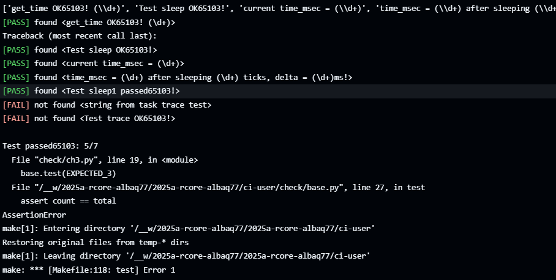

cargo build --release

timeout --foreground 30s qemu-system-riscv64 \
	-machine virt \
	-nographic \
	-bios ../bootloader/rustsbi-qemu.bin \
	-kernel target/riscv64gc-unknown-none-elf/release/os

python3 check/ch3.py < stdout-ch3 || (\
	make restore ; \
	exit 1 ; \
)
